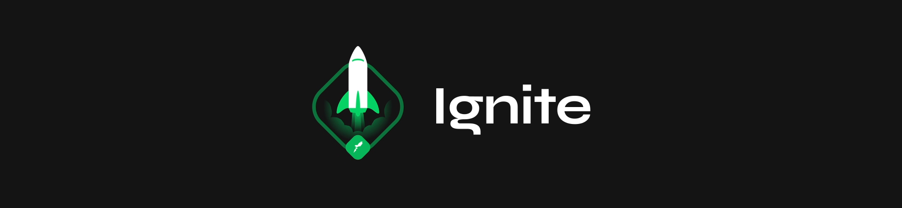

 

<h1 align="center">🚀 Ignite Challenges React</h1>

Challenges of the React Track from the Ignite Bootcamp provided by @Rocketseat.

## 💡 What is it?
The challenges from the React track from the Ignite Bootcamp provided by @Rocketseat. All the challenges will be here, to view one of them you'll need to install all the others.

## 🖥 Setup
- Clone the repository
- Enter the challenge folder you want
- Run `npm install` to install dependecies
- Run `npm run dev` to run the project

## 🚧 Built With
- ReactJS
- TypeScript